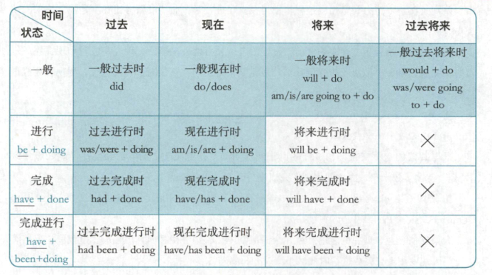

-
- 
-
- ## 现在时
- **现在完成时**：表示已经，经常和 already, for xxx 组合
- **现在完成进行时**：表示最近一直怎么样
	- I've been working on this project.
	- I've been feeling excited about xxx.
	- I've been feeling a bit overwhelmed.
-
-
-