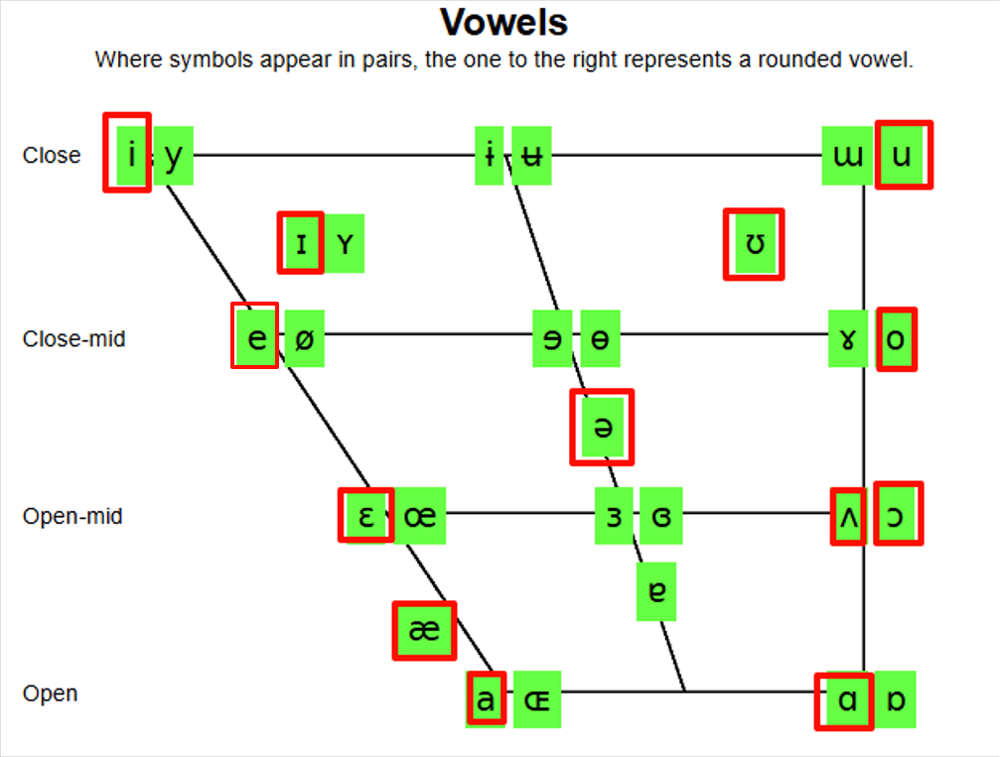
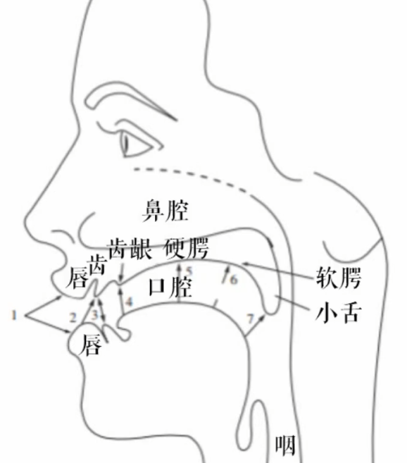
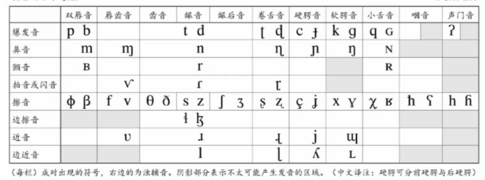

-
- ## 常用资源
- 国际音标发音示例：[IPA Chart](https://www.ipachart.com/)
- 大段英语查音标：[toPhonetics](https://tophonetics.com/)，注意切换至美音。
- 查单个单词如何发音：[Forvo](https://forvo.com/)
- ## 基础知识
- 元音：发音气流不受阻碍的音
- 辅音：气流受阻的音
-
- ## 单元音
- {:height 386, :width 477}
- #+BEGIN_NOTE
  横向表示声源前后，纵向表示舌位，竖线左侧表示咧嘴，右侧表示圆嘴。
  在英语中，ɪ、ɛ、æ、ə、ʊ、ʌ 比较短，其余一般为长音。
  美式英语中 a、e、ɔ 一般不单独发音
  #+END_NOTE
- ## 双元音
- |双元音|示例|
  |--|--|
  |/aɪ/|I /aɪ/|
  |/eɪ/|name /neɪm/|
  |/ʌɪ/|like /lʌɪk/ （词典里可能不这样写，一般 /aɪ/ 跟清音时北美会这样用）|
  |/ɔɪ/|boy /bɔɪ/|
  |/aʊ/|down /daʊn/，可以理解为 æ + ʊ|
  |/oʊ/|show /ʃoʊ/|
- |卷舌音标|示例|
  |--|--|
  |/ɜr/|her /hɜr/|
  |/ər/|sister /ˈsɪstər/|
  |/ɪr/|dear /dɪr/|
  |/ɛr/|air /ɛr/|
  |/ɔr/|before /bɪˈfɔr/|
  |/ʊr/|cure /kjʊr/|
  |/ɑr/|art /ɑrt/|
  |/aɪ(ə)r/|liar /ˈlaɪr/ 或者 /ˈlaɪər/|
-
- ## 辅音预备知识
- 辅音发音过程：成阻、持阻、除阻。持阻就是把气堵住，除阻就是气流冲开。
- 清音与浊音：清音声带不震动、浊音声带震动。
- 发音特征分类：
	- 塞音/爆破音：通过完全阻塞气流，突然释放以达到发音效果。包括 p, b, t, d, k, g
	- 擦音：在声道某个狭窄的通道流过达到发音效果。包括 f, v, s, z, ʃ, ʒ, h
	- 鼻音：气流流过鼻腔达到发音效果。包括 m, n, ŋ
	- 塞擦音/破擦音：首先完全阻断气流，然后缓慢释放气流，通过一个狭窄的通道产生摩擦。包括 tʃ, dʒ
- 发音位置分类：
	-
- {:height 461, :width 299}
-
-
-
- ## 辅音
- 
-
-
-